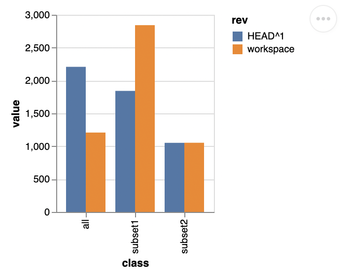
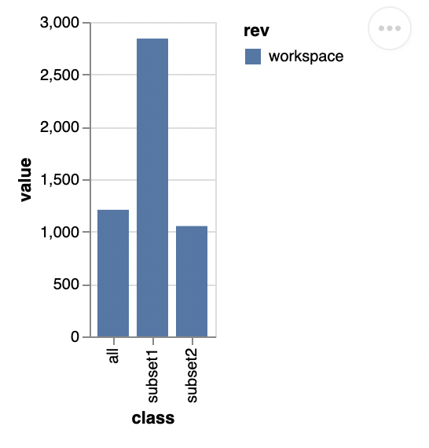

# DVC plot example with bar plots

This example shows how to use DVC to create bar-plots. The bar plots can be diff:ed between different data revitions to see how the distributions has changed.

When diffing plots the **vega-lite** xOffset parameter is used, this was added in **vega-lite** release 5.2.0, therefore a custom html-template is used.

To create a side-by-side bar plot, run:
```bash
dvc plots diff HEAD^1 --html-template html_template.html
```

The diff:ed plots look like this:


The plot of a single data commit looks like this:


# Using and modifying

The plot is definied in the **vega-lite** format in the file specified in the [.dvc/plots/bar.json](.dvc/plots/bar.json) file.
